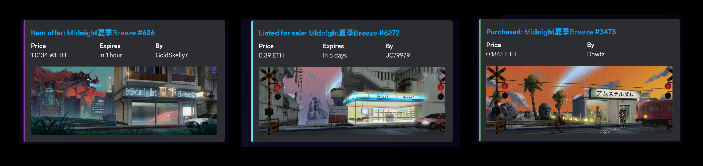

# opensea-activity-bot

A bot that shares new OpenSea events for a collection to Discord and Twitter.

Designed to handle multiple output configurations, like a Discord activity feed and a Twitter sales feed.

Originally developed for [@dutchtide](https://twitter.com/dutchtide)'s [𝕄𝕚𝕕𝕟𝕚𝕘𝕙𝕥 夏季 𝔹𝕣𝕖𝕖𝕫𝕖](https://opensea.io/collection/midnightbreeze) collection, on Twitter at [@mbsalesbot](https://twitter.com/mbsalesbot).

An OpenSea API key is needed - [request one here](https://docs.opensea.io/reference/request-an-api-key).

To run multiple instances of this bot at once check out [bot-runner](https://github.com/ryanio/bot-runner). Also check out [discord-nft-bot](https://github.com/ryanio/discord-nft-bot).

## Setup

### Env

Please define the env variables outlined in this section for the repository to work as intended.

**Valid event types**

Valid string values for event types to react on are:

- `created` for new listings and auctions
- `successful` for sales
- `cancelled`
- `offer_entered`
- `bid_entered`
- `bid_withdrawn`
- `transfer`

#### Project-specific

- `TOKEN_ADDRESS`

#### APIs

- `OPENSEA_API_TOKEN`
- `INFURA_PROJECT_ID` (for ENS support)

#### To share on Discord

- `DISCORD_EVENTS`
  - The Discord channel ID with a comma separated list of event types for the bot to send through discord
    - e.g. `662377002338091020=successful`
  - For multiple channels separate with an ampersand (&)
    - e.g. `662377002338091020=successful,created,cancelled&924064011820077076=bid_entered,bid_withdrawn`
- `DISCORD_TOKEN`
  - To get your `DISCORD_TOKEN`, [create a Discord app](https://discord.com/developers/applications). Create a bot with the permissions: `Send Messages` and `Embed Links`. Then [add your bot to your server](https://discordjs.guide/preparations/adding-your-bot-to-servers.html#bot-invite-links).
  - The `DISCORD_TOKEN` looks like this: `OTE5MzY5ODIyNzEyNzc5NzUz.YBuz2g.x1rGh4zx_XlSNj43oreukvlwsfw`

#### To tweet

- `TWITTER_EVENTS`
  - Comma separated list of event types for the bot to tweet
  - e.g. `successful,bid_entered`

Create an application in the [Twitter Developer Platform](https://developer.twitter.com/) and provide:

- `TWITTER_CONSUMER_KEY`
- `TWITTER_CONSUMER_SECRET`
- `TWITTER_ACCESS_TOKEN`
- `TWITTER_ACCESS_TOKEN_SECRET`

#### Optional

- `OPENSEA_BOT_INTERVAL`
  - Number of seconds interval for the bot to run (default: 60)
- `MIN_OFFER_USD`
  - Offers or bids less than this amount will be ignored (default: 100)

### Run

`yarn start`

#### Heroku

A `Procfile` is included for easy use on platforms like Heroku.

Clone this repo, push it to heroku, set up the environment variables above, and spin up a worker with `heroku ps:scale web=0 worker=1`

Then watch the logs with `heroku logs --tail`

If your discord bot is not able to post messages ensure it is added to the channels you've specified and it has the permissions to `Send Messages` and `Embed Links`.
